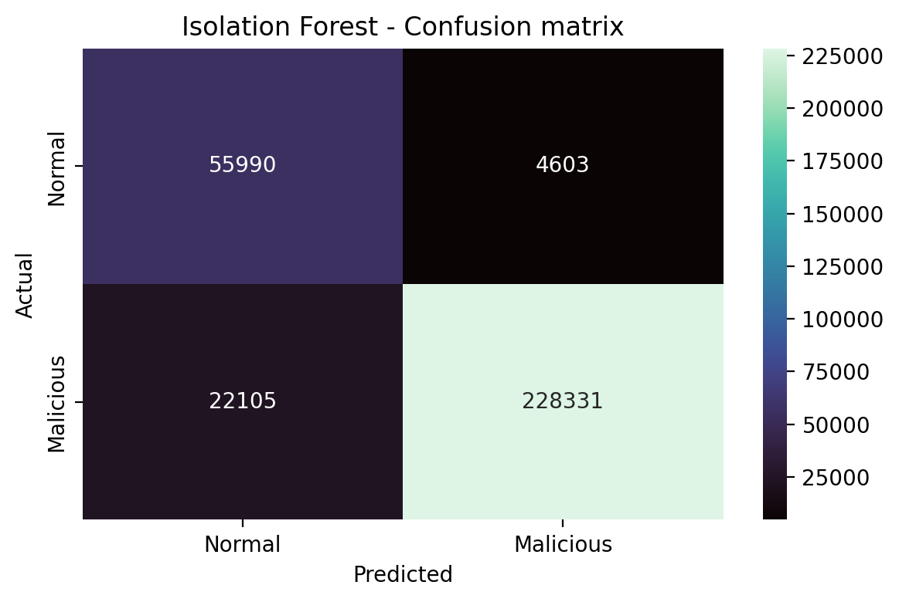
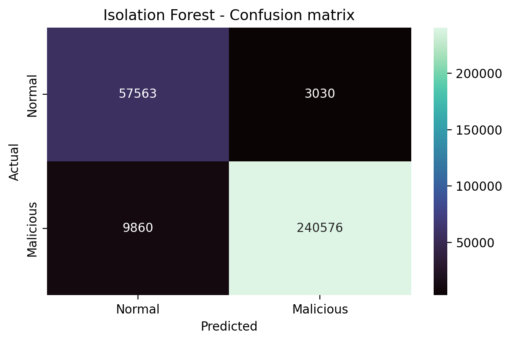
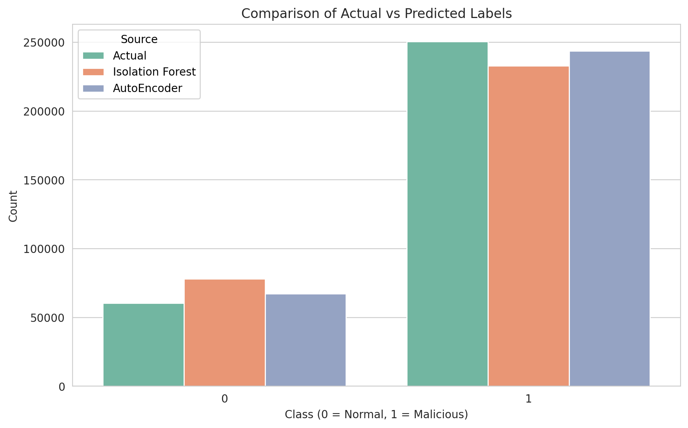

# ⚠️ Anomaly Detection in Network Traffic data

A look into Anomaly detection in network traffic data using unsupervised techniques like Isolation Forest, and Autoencoders. This notebook and website deals with detecting malicious data from normal ones in the [KDD Cup 1999 dataset](https://www.kaggle.com/datasets/galaxyh/kdd-cup-1999-data). Most of todays `Intrution Detection Systems (IDSs)` work in a similar way to detect cyber attacks in devices.

---

## ❔ What is an anomaly?

An anomaly in network traffic data refers to any pattern in the network's behavior that deviates significantly from what is considered normal or expected. These anomalies can indicate malicious activities, system failures, or unusual usage patterns.

For example,

-   If a network usually sees 100 requests per second from a server, and suddenly it jumps to 10,000 requests per second — that's an anomaly.

---

## 💡 Common Types of Network Anomalies:

1.  **Volume Anomalies**: Sudden spikes or drops in traffic volume. Example: DDoS attacks where attackers flood the network.
2.  **Protocol Anomalies**: Unexpected or malformed use of network protocols. Example: ICMP packets being used for data exfiltration.
3.  **Time-based Anomalies**: Unusual activity at odd hours (e.g., midnight data transfers).
4.  **Behavioral Anomalies**: A user account accessing resources it never accessed before. Example: A sales employee suddenly accessing financial databases.
5.  **Geographical Anomalies**: Traffic from unexpected locations (e.g., foreign IPs accessing a local intranet).

---

## 📈 Why Detecting Anomalies Matters:

-   `Cybersecurity`: Detect intrusions, malware, and insider threats.

-   `Performance Monitoring`: Spot bottlenecks and outages.

-   `Compliance`: Ensure data usage policies are followed.

---

## 🔍 How It’s Done:

1. **Statistical Models**: These rely on mathematics to define "normal" behavior, and anything that deviates significantly is considered anomalous. Example: Z-score.
2. **Rule-based Systems**: These work based on pre-defined rules. Example: If traffic > 10,000 packets per second → alert.
3. **Machine Learning**: These methods learn from data patterns to detect what’s unusual. Example: Isolation Forest, Autoencoders.

---

## 🌲 Isolation Forest

-   Isolation Forest is an efficient and simple algorithm used for anomaly detection.
-   It identifies outliers in large datasets by isolating them through binary partitioning.
-   Outliers are easier to isolate and given higher anomaly scores.
-   There are three main features of this model:
    1. _Isolation_: This algorithm isolates the anomalies by focusing on their differences from normal data points.
    2. _Partitioning_: Data is split by randomly selecting features and using random values to partition the data.
    3. _Anomaly Score_: It measures how easily a data point can be isolated. Points that require fewer splits to isolate are considered anomalies and assigned higher scores.

## 🤖 Autoencoders

-   Autoencoders are a type of neural networks that learn to compress data into a compact form and then reconstruct it to closely match the original input.
-   The model trains by minimizing reconstruction error using loss function: **Mean Squared Error**.
-   They consist of:
    1. _Encoder_: They capture important features by reducing dimensionality.
    2. _Bottleneck_: It is the smallest layer which represents the most compressed version of the input data.
    3. _Decoder_: They rebuild the data from this compressed representation.

---

## ⚙️ Workflow of the notebook

-   **Gather dataset**: Gather the KDD Cup 1999 Dataset.

-   **Select files**: I chose to use the full dataset in the file `kddcup.data.gz` for training, and `corrected.gz` for testing and evaluation.

-   **Feature Selection**: Since the dataset has _41_ features, select _10_ of the most important features and the target label:

    1. `duration`: Length of the connections (in seconds).
    2. `protocol_type`: Type of Protocol used to make the connection (eg. TCP, UDP, or ICMP).
    3. `service`: Network Service on the destination (eg. TELNET, HTTP, etc).
    4. `src_bytes`: Number of data bytes from source to destination.
    5. `dst_bytes`: Number of data bytes from destination to source.
    6. `logged_in`: Yes if successfully logged in, No otherwise.
    7. `count`: Number of connections to the same host as the current connection in the past two seconds.
    8. `srv_count`: Number of connections to the same service as the current connection in the past two seconds.
    9. `dst_host_count`: Number of connections to the same destination host as the current connection in the past 100 connections.
    10. `dst_host_srv_count`: Number of connections to the same destination host and same service as the current connection in the past 100 connections.
    11. `label`: The target label, either _normal_, or _malicious_.

-   **Preprocessing**:

    1. Filter out only _normal_ data for training.
    2. Drop _target_ label for unsupervised learning.
    3. For the numerical columns, apply Z-score normalization technique using `sklearn.preprocessing.StandardScaler()`.
    4. For the categorical columns, apply one-hot encoding to convert everthing to binary (0/1) features using `sklearn.preprocessing.OneHotEncoder()`.

-   **Training the models**:

    1. `Isolation Forest`: The model is trained on normal data with the _contamination_ parameter set to _auto_, so that it adjusts automatically and a random state of _42_ to ensure reproducibility.

    2. `Autoencoder`: The model was trained to detect anomalies by learning to reconstruct the input data (which has been preprocessed). The model compresses the input into a lower-dimensional latent space (using two dense layers: 64 and 32 units) and then reconstructs it back to the original size. It's trained using **mean squared error (MSE)** as the loss function, so it learns to minimize the difference between input and output. The idea is that the model will reconstruct normal data well and produce a high reconstruction error for anomalous data, which it hasn't seen before. It uses early stopping to prevent overfitting and stops training when the validation loss doesn't improve for 3 epochs.

-   **Evaluation**:

    1. `Isolation Forest`: The _corrected.gz_ data was used to do the predictions. The predictions from _predict()_ are 1 for normal and -1 for anomalies, so we converted this to a binary format: 0 for normal and 1 for anomaly.

    2. `Autoencoder`: The _corrected.gz_ data was used to do the predictions. The model detects anomalies based on reconstruction error. First, it predicts the reconstructed output for the test data. Then, it computes the mean squared error (MSE) between each input row and its reconstruction, resulting in an array of reconstruction errors. It then extracts the MSEs of only the normal samples and sets a threshold at the 95th percentile of these errors — meaning only the top 5% highest errors among normal data are treated as suspicious. The threshold came out to be _0.0013_. Finally, any test sample with an error above this threshold is labeled as an anomaly (1), and the rest as normal (0).

-   **Results**: Both models performed quite well on the testing data. The `Isolation Forest` model reached an accuracy of **91%**, while the `Autoencoder` model reached an accuracy of **96%**.

---

## 🕸️ Demo

The model was deployed on [Render](https://render.com/), with the help of `Flask` backend. But the website is taking a long to load because of the heavy machine learning libraries used. So, here is a demo of the interface:

### See the full demo [here](demo/video-demo.mp4).

---

## 📊 Visualizations

<h3 align="center">
1. Confusion Matrix - 🌲 Isolation Forest
</h3>

<h3 align="center">
2. Confusion Matrix - 🤖 Autoencoder
</h3>

<h3 align="center">
3. Comparision of Actual and Predicted (of both models)
</h3>

---

## ✅ Conclusion

This project demonstrates how unsupervised learning techniques like `Isolation Forest` and `Autoencoders` can effectively detect anomalies in network traffic data, a key task in modern `Intrusion Detection Systems (IDS)`. Using a subset of carefully selected features from the **KDD Cup 1999 dataset**, the models were trained exclusively on normal traffic and successfully identified malicious patterns in unseen data. The Autoencoder, by leveraging deep learning, achieved a higher accuracy (_96%_) compared to the Isolation Forest (_91%_), highlighting the power of neural approaches for capturing complex patterns. Overall, the project showcases a robust pipeline — from data preprocessing to model evaluation and deployment — that can serve as a foundation for real-world network security applications.
